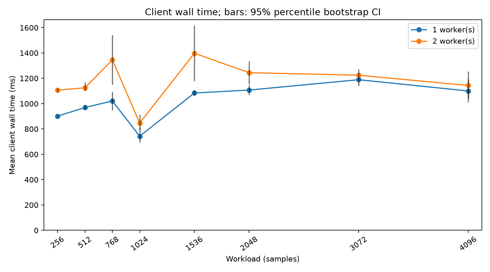
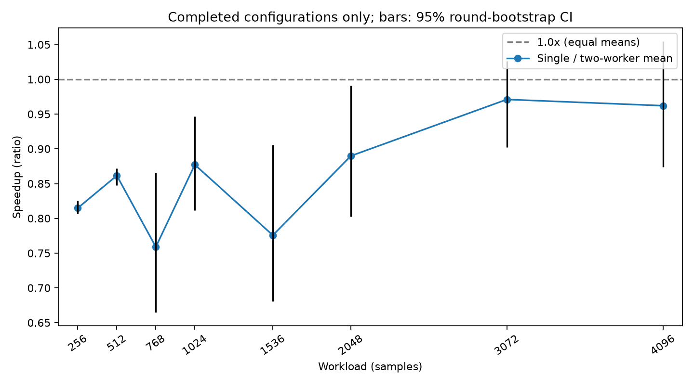
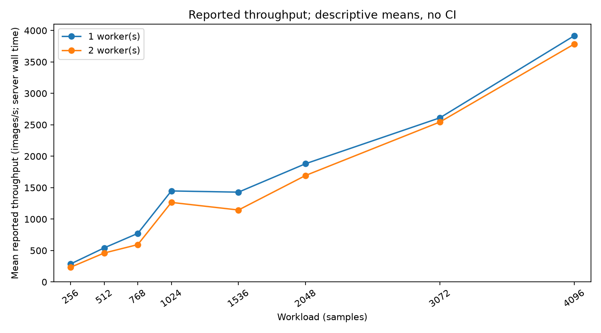
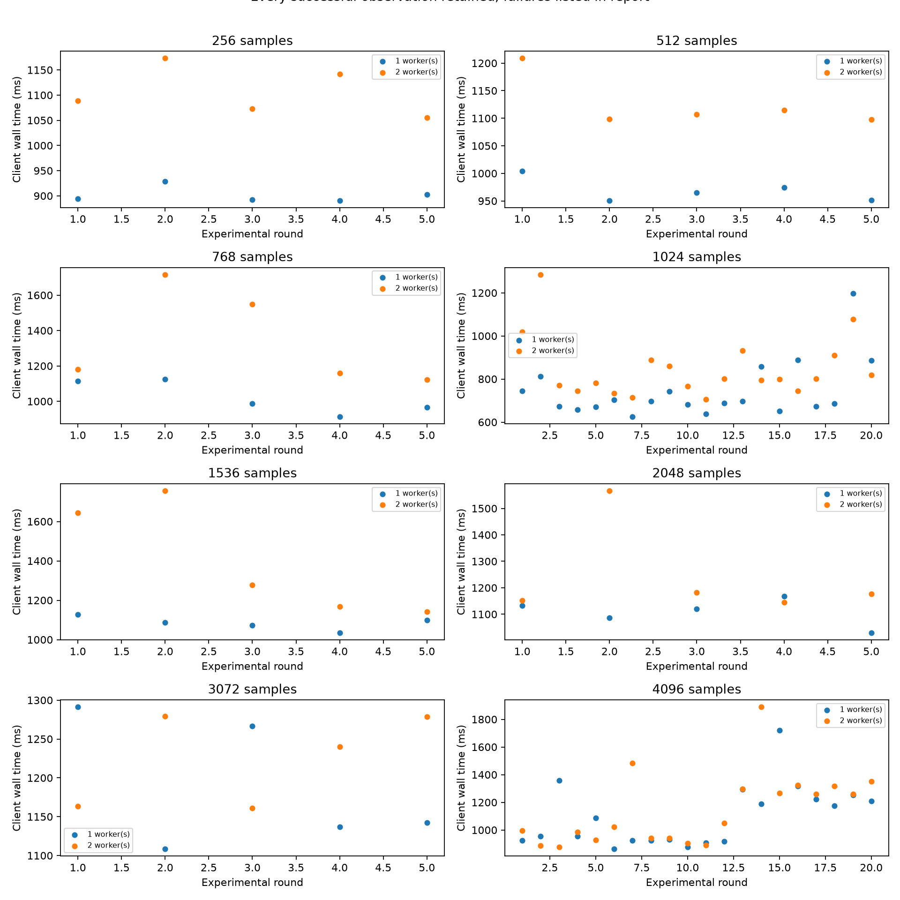

# ColabCluster repeatability and crossover validation

## Setup and provenance

Experiment: `validation_20261010T121739Z_267815ff`. Raw attempts: 140. Inputs are read-only; SHA256 hashes are in analysis.json.
Stop reason: None recorded.
Software: {"git_commit": "21e2a4033fd0e792b2726760e006880c45b6f52f", "packages": {"matplotlib": "3.11.2", "pydantic": "2.13.5", "requests": "2.34.2"}, "python": "3.14.3", "source_sha256": {"common/scaling.py": "bd0717011d689d64cae8eed07df61fd1d89659b2ab31e65528dfd345ae0d8b14", "controller/scaling.py": "72cc00162913cc7204cacf5efe0876d3e72d7382982011e989cce5350a1e6297", "scripts/analyze_scaling_validation.py": "459d144b9e6e7622fbb5c047334cb58a7941afacf64966dacda81b398e9a9ed3", "scripts/validate_scaling.py": "9cda480d72b001920ef484b02ef2656c1a4e63412f2128d3f34cacddbae7c67f", "worker/cnn_test.py": "3fbfebc251a939c06a26d9382c323224183960ff375b78cbd58266d7dc0feb12", "worker/inference.py": "7d5abb426aa9852b3d180d718190d5bbb1ad17849432f3f5b657056876c9fcaf"}}

Recorded workers (no tunnel addresses or credentials):
```json
{
  "COLAB-GPU-TEST": {
    "worker_id": "COLAB-GPU-TEST",
    "gpu": "Tesla T4",
    "gpu_memory": 14.56317138671875,
    "registered_at": "2026-10-10T12:13:07.626229Z",
    "cuda_available": true,
    "software": {
      "platform": "Linux",
      "python_version": "3.13.15",
      "torch_version": "2.11.0+cu130"
    }
  },
  "COLAB-GPU-TEST-2": {
    "worker_id": "COLAB-GPU-TEST-2",
    "gpu": "Tesla T4",
    "gpu_memory": 14.56317138671875,
    "registered_at": "2026-10-10T12:16:39.433097Z",
    "cuda_available": true,
    "software": {
      "platform": "Linux",
      "python_version": "3.13.15",
      "torch_version": "2.11.0+cu130"
    }
  }
}
```
Observed response CUDA/PyTorch versions:
```json
{
  "COLAB-GPU-TEST": {
    "cuda_version": "13.0",
    "torch_version": "2.11.0+cu130"
  },
  "COLAB-GPU-TEST-2": {
    "cuda_version": "13.0",
    "torch_version": "2.11.0+cu130"
  }
}
```
Model/input configuration:
```json
{
  "model": "SmallCNN",
  "model_seed": 0,
  "input_seed_base": 1000,
  "input_block_samples": 32,
  "dtype": "float32",
  "device": "cuda:0",
  "warmups": 10,
  "timed_forwards": 1,
  "timing": "client perf_counter complete HTTP body before JSON parsing",
  "order": "seeded balanced alternating rounds",
  "protocol": "scaling-validation-v1"
}
```

## Descriptive measurements

| Samples | Workers | Passed/target | Failed | Mean ms | Median ms | SD ms | IQR ms | Min/max ms | Mean CI ms | Mean/median server ms | Summed GPU ms | Reported images/s |
|---|---|---|---|---|---|---|---|---|---|---|---|---|
| 256 | 1 | 5/5 | 0 | 901.575 | 894.586 | 15.606 | 10.189 | 890.838/928.355 | 892.034, 911.116 | 893.268/886.763 | 1.848 | 286.649 |
| 256 | 2 | 5/5 | 0 | 1106.383 | 1089.118 | 49.187 | 68.810 | 1055.624/1172.974 | 1093.391, 1119.376 | 1095.179/1080.372 | 2.012 | 234.200 |
| 512 | 1 | 5/5 | 0 | 969.299 | 964.789 | 21.866 | 22.941 | 950.896/1004.205 | 954.050, 987.657 | 944.665/943.676 | 3.510 | 542.164 |
| 512 | 2 | 5/5 | 0 | 1125.110 | 1106.635 | 47.189 | 15.729 | 1097.335/1208.633 | 1099.704, 1167.769 | 1113.172/1090.394 | 3.668 | 460.627 |
| 768 | 1 | 5/5 | 0 | 1021.173 | 986.247 | 94.674 | 150.352 | 913.377/1126.018 | 948.574, 1093.771 | 1000.068/956.093 | 5.167 | 772.470 |
| 768 | 2 | 5/5 | 0 | 1345.478 | 1181.181 | 269.316 | 388.847 | 1122.554/1716.565 | 1148.906, 1542.049 | 1333.390/1152.938 | 5.354 | 594.076 |
| 1024 | 1 | 20/20 | 0 | 743.192 | 692.266 | 133.118 | 89.279 | 625.413/1196.651 | 694.714, 807.619 | 725.360/674.629 | 6.831 | 1447.831 |
| 1024 | 2 | 20/20 | 0 | 847.253 | 800.202 | 142.435 | 132.476 | 704.990/1285.024 | 793.224, 914.075 | 828.520/784.876 | 7.021 | 1265.598 |
| 1536 | 1 | 5/5 | 0 | 1084.213 | 1087.236 | 34.157 | 26.865 | 1034.481/1126.816 | 1062.865, 1105.561 | 1075.925/1079.579 | 9.988 | 1428.799 |
| 1536 | 2 | 5/5 | 0 | 1397.727 | 1278.101 | 284.004 | 478.375 | 1142.381/1756.286 | 1179.271, 1616.182 | 1386.660/1269.033 | 10.336 | 1144.695 |
| 2048 | 1 | 5/5 | 0 | 1107.257 | 1119.540 | 52.086 | 46.164 | 1029.614/1167.194 | 1068.585, 1144.006 | 1090.046/1096.856 | 15.549 | 1881.484 |
| 2048 | 2 | 5/5 | 0 | 1244.368 | 1176.784 | 181.004 | 30.878 | 1144.302/1566.863 | 1153.680, 1335.055 | 1227.189/1156.842 | 13.663 | 1694.358 |
| 3072 | 1 | 5/5 | 0 | 1188.985 | 1142.334 | 83.468 | 129.742 | 1108.378/1291.287 | 1140.038, 1224.419 | 1180.948/1136.018 | 20.373 | 2611.381 |
| 3072 | 2 | 5/5 | 0 | 1224.445 | 1239.888 | 58.992 | 115.332 | 1161.073/1279.146 | 1193.063, 1271.042 | 1208.982/1216.342 | 19.879 | 2544.884 |
| 4096 | 1 | 20/20 | 0 | 1100.219 | 1022.259 | 222.452 | 304.754 | 862.625/1721.553 | 1012.401, 1192.747 | 1084.477/1012.053 | 25.660 | 3916.505 |
| 4096 | 2 | 20/20 | 0 | 1143.618 | 1034.993 | 261.704 | 364.494 | 878.452/1889.739 | 1038.999, 1254.724 | 1130.791/1028.308 | 30.922 | 3784.187 |

## Calculated effects (only when both targets are met)

| Samples | Complete | Speedup | Wall change % | Difference two-minus-one ms | Throughput change % | Speedup CI | Difference CI ms | Paired/unpaired rounds |
|---|---|---|---|---|---|---|---|---|
| 256 | True | 0.815 | 22.717 | 204.808 | -18.298 | [0.8064416713215548, 0.8256393669582405] | [191.14638000610285, 215.7762599963462] | 5/0 |
| 512 | True | 0.862 | 16.075 | 155.810 | -15.039 | [0.847570276969901, 0.8721276411406303] | [141.66415999643505, 178.48223999608308] | 5/0 |
| 768 | True | 0.759 | 31.758 | 324.305 | -23.094 | [0.6646824443487698, 0.8654362938170522] | [156.17886000545695, 504.2899399995804] | 5/0 |
| 1024 | True | 0.877 | 14.002 | 104.060 | -12.587 | [0.8115474474745377, 0.9463421704501951] | [44.475910498968005, 167.40029687396597] | 20/0 |
| 1536 | True | 0.776 | 28.916 | 313.514 | -19.884 | [0.6807322485037428, 0.9058463240894825] | [111.03265999990981, 515.9949400142068] | 5/0 |
| 2048 | True | 0.890 | 12.383 | 137.110 | -9.946 | [0.8025189164752099, 0.9906530460469501] | [10.793859994737431, 263.4270199923776] | 5/0 |
| 3072 | True | 0.971 | 2.982 | 35.460 | -2.546 | [0.9025069422628909, 1.0258827195820912] | [-30.891719995997846, 123.15224000485614] | 5/0 |
| 4096 | True | 0.962 | 3.945 | 43.399 | -3.378 | [0.873736324124495, 1.054355952717088] | [-59.1417036238272, 153.71717524887572] | 20/0 |

## Interpretation

4096-sample repeatable advantage supported under the stated bootstrap assumptions: **not established**.
Smallest tested workload with a completed measured mean advantage: **not established**. Neighboring tested workloads and uncertainty are shown above; this is not an exact crossover threshold.
A lower mean alone is not called statistically significant. Confirmation requires the full target and a two-minus-one 95% interval wholly below zero. This is conditional evidence within this session, not proof of universal scaling or persistence across Colab sessions.
If confirmation is absent or uncertain, the next experiment is a fresh fully updated session with the same balanced design and more independent rounds/sessions, not a scheduler or architectural change.

## Statistical method and limitations

Analysis seed 20261010; 5000 resamples; 95% percentile intervals. Means use order-stratified resampling of observed rounds. Comparisons resample whole rounds jointly within first-configuration strata, retaining one/two-worker dependence and unpaired successful observations. Fewer than five paired rounds suppress comparison intervals. Missing/failing trials are counted; successful outliers are never removed.
Assumptions: rounds are exchangeable within order strata; both configurations in a round share comparable conditions. Time drift/autocorrelation across rounds, failures not missing at random and changes across workloads can invalidate nominal coverage. With five exploratory rounds intervals are particularly unstable. Pointwise intervals across eight workloads are not multiplicity-adjusted; crossover selection is exploratory, not a confirmatory significance claim.
Client perf_counter covers complete HTTP response receipt before parsing. Server wall time includes remote model/input setup, warmup, dispatch and validation. Summed GPU time is compute across devices, never parallel elapsed time. Reported throughput is the mean of server-based sample rates, not samples divided by mean client wall time.
The two confirmation sizes run first. Exploratory sizes use the same session/method and confirmation observations are reused, not rerun or merged with older data. Older five-trial experiments lack sufficient round/seed/source metadata and are deliberately not pooled. Workload order and preflight traffic remain possible confounders. Worker/model inputs match but a random untrained model and synthetic data do not measure application accuracy.
Bootstrap reference: [SciPy bootstrap documentation](https://docs.scipy.org/doc/scipy/reference/generated/scipy.stats.bootstrap.html). The local implementation uses the standard library and round-level sampling rather than adding SciPy.

## Failed attempts / incomplete configurations

No failed inference attempts recorded. Zero attempts after a blocked preflight is not a successful experiment.

## Figures





